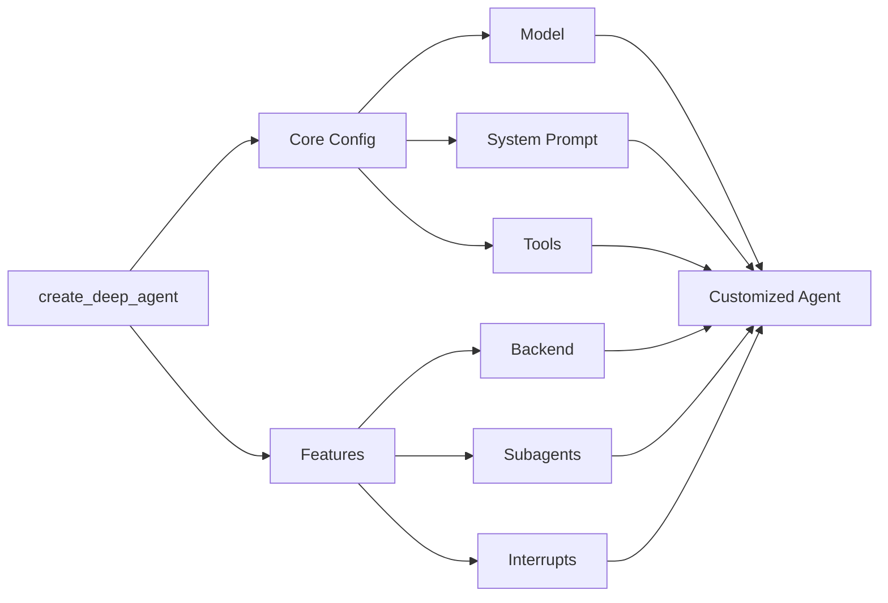

 # Session #4: 🔄 Multi-Agent Applications & Deep Research
 
🎯 Understand when to add additional agents to optimize context and how to construct agent teams to do deep research.

📚 **Learning Outcomes**
- Understand multi-agent systems, and typical multi-agent patterns
- Learn when to add more agents to optimize context
- Learn the four key elements of Deep Agents and how to implement them, including planning and task decomposition, context management, subagent spawning, and long-term memory
- Learn the lessons the LangGraph team learned building Open Deep Research — including when to add and remove structure
- Understand the three-step process for conducting research: scope, research, write

🧰 **New Tools**
- Agent Tools: [Tavily Search](https://www.tavily.com/?utm_term=tavily&utm_campaign=Tavily+Brand+-+General&utm_source=adwords&utm_medium=ppc&matchtype=e&device=c&utm_content=789180622957_&utm_position=&gad_source=1&gad_campaignid=23289739393&gbraid=0AAAABB_ZBWrAq-75KiYAuqIBFNb0FjkZm&gclid=CjwKCAiAj8LLBhAkEiwAJjbY79-3SS5jmAv3MoEzecsB7GrPm_P9cbu_KSKwffFEhBjTNK4DV31q8BoC1rEQAvD_BwE)

## 📛 Required Tooling & Account Setup
In addition to the tools we've already learned, in this session you'll need:
    
1. [Tavily API](https://www.tavily.com/)
   
## 📜 Recommended Reading

- [Don’t Build Multi-Agents](https://cognition.ai/blog/dont-build-multi-agents) (June 2025)
- [Context Rot](https://research.trychroma.com/context-rot) (July 2025)
- [Workflows and agents](https://docs.langchain.com/oss/python/langgraph/workflows-agents), by LangGraph
- [Deep Agents](https://blog.langchain.com/deep-agents) (July 2025)
- [Doubling down on DeepAgents](https://blog.langchain.com/doubling-down-on-deepagents) (Oct 2025)
- [The Bitter Lesson](http://www.incompleteideas.net/IncIdeas/BitterLesson.html) by Rich Sutton (March 2019) — the foundational essay on why general methods leveraging computation always win
- [Learning the Bitter Lesson](https://rlancemartin.github.io/2025/07/30/bitter_lesson/) by Lance Martin (July 2025) — how the Bitter Lesson applies directly to building deep research systems
- [How we built our multi-agent research system](https://www.anthropic.com/engineering/multi-agent-research-system) (June 2025) — Anthropic's lessons on system architecture, tool design, and prompt engineering for research agents
- [Deep Research Bench](https://deepresearch-bench.github.io/) — 100 PhD-level research tasks for benchmarking deep research systems

# 🗺️ Overview

# Overview

In Session 4, we’ll cover multi-agent applications! This class of LLM applications adds an additional layer of complexity to our ability to create agentic applications.

The same core concepts will be used to understand multi-agent systems as we used to understand agents in the first place, including tools, enhanced retrieval and search (a.k.a. “Fancy RAG”), the Reasoning-Action pattern, and function calling.

Multi-agent systems allow us to functionally split up and allocate work to our agents based on their specific responsibilities. This allows us to create clean conceptual models that are quite useful and often align with the way work is split up today between humans in different roles or by a single human completing multiple tasks towards the solution of a problem.

We’ll also connect these ideas to Deep Research: multi-agent systems that autonomously explore, gather, and synthesize information from search tools, reference documents, code execution, and other sources. This pattern is one of the clearest examples of why multi-agent applications matter in practice, and it will serve as the primary use case we build toward in this session.

# 🤖 Multi-Agent Systems

If we define an agent as “a system that can leverage reasoning to make dynamic decisions in an application flow,” we can extend this definition directly to multiple agents.

<aside>
📖

Multi-Agent System: A system that can leverage reasoning from multiple independent agents to make dynamic decisions in an application flow

</aside>

According to LangChain, “multi-agent” means “**multiple independent actors powered by language models connected in a specific way.**” [[Ref](https://blog.langchain.dev/langgraph-multi-agent-workflows/)].

This all makes multi-agent systems sound quite abstract and confusing.  However, we can clarify this by saying that the ***agents within multi-agent systems are specialized LLMs*.** 

What is important to understand now is that *each agent/LLM in a multi-agent system must play a specialized role*.

What role should each agent play?  It depends - on the application and the implementation.

# ♾️ Many vs. One: Why?

Why would we need many agents if it’s hard enough to set up a single agent in a useful way?

> “Agents are useful when you need an LLM to determine the workflow of an app” ~ [**✅ When to use agents / ⛔ when to avoid them](https://huggingface.co/blog/smolagents#%E2%9C%85-when-to-use-agents--%E2%9B%94-when-to-avoid-them)** by Hugging Face
> 

Well, yes, it is. 

And we should use many agents only when we really need to use many agents.

Think about the questions you should be able to answer before building an agentic system of any kind, even with just one agent:

> Do I **really need flexibility** in the **workflow** to efficiently **solve the task** at hand?
> 

We always want to consider how much agency we need in our workflows, as we know “agentic systems consist of both workflows and agents (and everything in between.” [[Ref](https://blog.langchain.com/how-to-think-about-agent-frameworks/)]

We might ask the question a slightly different way for a single agent system so that it is extensible to multiple agents:

> Do I really need **dynamic reasoning** to solve the task (or problem) more effectively than a rigid workflow could?
> 

If we use this kind of approach, we can more easily understand the Keep-It-Simple-Stupid approaches that we’re always reminded of by leading researchers and labs; e.g.,

> “When building applications with LLMs, we recommend **finding the simplest solution possible**, and *only increasing complexity when needed*.” ~ [Building effective agents](https://www.anthropic.com/engineering/building-effective-agents), by Anthropic
> 

The additional benefit of this approach is that it scales to multiple agents.

> Do I really need several specialized **dynamic** **reasoning** machines collaborating to solve the task (or problem) **more effectively** than a single agent could?
> 

In other words, for one agent, how much agency over workflow do I need?

- Do I have too many if-elseif-elseif-else statements?

And then, to add an additional agent, how much additional agency over the agentic workflow I already have do I need. Again:

- Do I have too many if-elseif-elseif-else statements?

While agents can give rise to complexity, the key benefit of setting up systems using a multi-agent framework is to **reduce complexity**. This gives us more clarity on our problem and solution, and ideally, even better performance.

Here are the techniques we’ll use to reduce complexity and increase performance by going from one to many:

1. 🧑‍🤝‍🧑 **Grouping** tools and responsibilities: analogous to how we separate work between people in an organization.
2. 🗨️ **Separating** prompts and few-shot examples: toward using multiple fine-tuned, specialized LLMs. 
3. 🧩 Easier **piecewise optimization**: using a simple conceptual model with plug-and-play pieces allows us to focus on each piece without jeopardizing the whole

Given these core ideas, here are a few thinking questions!

- 🙋 Could you use a single monolithic agentic application and/or mega prompt instead of a multi-agent setup?
    - ✅ Likely, Yes. But, as we’ll see, that would be stupid for many reasons.
- 🙋 Theoretically, if we had achieved AGI would there be any need for multiple agents?
    - ✅ Technically, no.  However, from a business perspective, it would make sense to “right-size” the LLMs we need, making them less general and more specific, and eliminate any additional compute and model capability we don’t need before deploying our product at scale to many users. Also, from a context engineering perspective, this would simply not be feasible by the limitations of LLM technology!

# 🪟 Context Engineering for Multi-Agent Systems

Insofar as definitive work exists for this space, we can point to a few leading thinkers who have developed some of the latest and greatest ideas:

1. **Dex Horthy: 12-Factor Agents [[GitHub](https://github.com/humanlayer/12-factor-agents?tab=readme-ov-file), [Talk](https://www.youtube.com/watch?v=8kMaTybvDUw)]**

> In the spirit of Heroku's 12 Factor Apps (https://12factor.net/), these principles focus on the engineering practices that make LLM applications more reliable, scalable, and maintainable. Even as models get exponentially more powerful, these core techniques will remain valuable.
> 

<aside>
💡

Big idea: own your context window and treat it like prime real estate; minimize “context utilization”

</aside>

1. **swyx: Agent Engineering [[Blog](https://www.latent.space/p/agent), [Talk](https://youtu.be/5N33E9tC400)]**

<aside>
💡

Big idea: agent reliability = great context construction

</aside>

1. **Chroma: Context Rot  [[Blog](https://research.trychroma.com/context-rot)]**

> “Large Language Models (LLMs) are typically presumed to process context uniformly—that is, the model should handle the 10,000th token just as reliably as the 100th. However, in practice, this assumption does not hold.”
> 

<aside>
💡

Big idea: longer ≠ better when it comes to context; performance can *degrade* as you shove in more tokens

</aside>

1. **Design Patterns for Securing LLM Agents against Prompt Injections [[Ref](https://arxiv.org/abs/2506.08837)], reviewed by [Simon Willison](https://simonwillison.net/2025/Jun/13/prompt-injection-design-patterns/#the-context-minimization-pattern)**

> [The Context-Minimization Pattern](https://simonwillison.net/2025/Jun/13/prompt-injection-design-patterns/#the-context-minimization-pattern): To prevent certain user prompt injections, the agent system can remove unnecessary content from the context over multiple interactions.💡 Big Idea (for this context!): Prompt injection is a very hard problem to solve, but one way to mitigate the risk of prompt injections is to minimize what is put in context
> 

<aside>
💡

Big Idea: one way to help secure against Prompt Injections is to minimize the amount of stuff you put in context 

</aside>

1. **Context Engineering for AI Agents: Lessons from Building Manus [[Ref](https://manus.im/blog/Context-Engineering-for-AI-Agents-Lessons-from-Building-Manus)],** [reviewed by Dex Horthy](https://boundaryml.com/podcast/2025-08-12-manus-context-engineering)

> *"Context Engineering is an active process. It's about managing the model's memory with smart cache strategies, structuring inputs for efficiency, and reinforcing key information to guide the LLM, ensuring it stays on-task and performs effectively."*
> 
- Reinforce context, don’t just assume you can rely on short- or long-term memory
- Use few-shot prompting sparingly
- Prompt structure directly impacts speed and cost

<aside>
💡

Big Idea: context becomes long over time when applications are used; managing context is a journey, not a destination

</aside>

What can we learn?

- Own and minimize context to optimize it
- Actively manage context over time

That is, the volume and type of data we put in context at any point in our AI application’s lifecycle drives not only the quality of output, but also the security of our systems.

TL;DR: Garbage in, Garbage Out. Too much Garbage in is actually unsafe. Super trash.

# 🧱 Multi-Agent Implementations

LangChain describes multi-agent systems as being “connected in a specific way.”  The “specific way” we connect agents outlines the implementation we use in our application flow.

While there are no hard and fast hierarchies or limits to how we can connect agents, either with tools or more generically by calling any Python function, we do have starting points that we’ll discuss.

As an introduction, let’s consider three typical implementations outlined in [LangGraph: Multi-Agent Workflows](https://blog.langchain.dev/langgraph-multi-agent-workflows/):

1. Multi-Agent Collaboration: all the work done by any agent is visible to all others
2. Agent Supervisor: supervisors are responsible for routing to individual contributors (agents)
3. Hierarchical Agent Teams: A supervisor of teams routes to supervisors responsible for routing to individual agents

But of course, this just scratches the surface of the many ways that we can think about building with complex multi-agent patterns, even just using LLMs!

We can go deeper into patterns through [**Zero to One: Learning Agentic Patterns** from Phil Schmi](https://www.philschmid.de/agentic-pattern)d (June, 2025) and [Key Agentic Design Patterns](https://www.deeplearning.ai/the-batch/how-agents-can-improve-llm-performance/?utm_campaign=The%20Batch&utm_source=hs_email&utm_medium=email&_hsenc=p2ANqtz-8TZzur2df1qdnGx09b-Fg94DTsc3-xXao4StKvKNU2HR51el3n8yOm0CPSw6GiAoLQNKua), by [Deeplearning.ai](http://Deeplearning.ai) (March-April, 2024). In fact, we can broadly categorize many of these patterns into three types:

1. Single Agent
    - **Router**/Gating
    - **Tool** using ReAct Loop
    - **Planning** (Decompose-then-execute)
    - **Reflection**/Self-Critique
    - **Evaluator**Optimizer
    - **Self-consistency** & committees
    - **Memory** patterns
    - **Parallelization**
    - **HITL**/Interrupts & Approvals
    - **Guardrails** & “tool-required”
2. Multi-Agent
    - **Orchestrator**Workers (**Supervisor**)
    - **Handoffs** as Tools
    - **Hierarchical Teams** (Team-of-Teams)
    - **Network**/Free-Graph **Swarms**
    - **Debate**/Adversarial collaboration
    - **Role**playing
    - **Mixture** of-Agents
3. Domain-Specific
    - **Deep Research Loops**
    - **Coding Agent Loops**

# 📶 Deep Agents

> **Tip:** For building simpler agents, consider using LangChain’s `create_agent` or building a custom LangGraph workflow [Ref].

Over the past few years, an interesting pattern has emerged: `the top consulting use cases become a feature in the apps built by leading LLM model providers (and now leading agent labs)`. 

While from 2024 to 2025 we saw it play out with Report Generation into Deep Research tooling, we might also point out that from 2023 to 2024 we saw a similar evolution with respect to to code generation, which continues to be an absolutely killer use case for emerging productions/companies in Silicon Valley, including [Cursor](https://cursor.com/en)/[Anysphere](https://anysphere.inc/) and [Devin](https://devin.ai/)/[Cognition](https://cognition.ai/) (acquirers of the [Windsurf](https://cognition.ai/blog/windsurf) team), and others. It’s worth mentioning that [ChatGPT Codex](https://openai.com/index/introducing-upgrades-to-codex/) and [Claude Code](https://claude.com/product/claude-code) fit into this hierarchy of different levels of [Coding Agents](https://www.youtube.com/live/S0EwhDf94JI?si=vUchjUL_NDoRrwuO&t=644) as well.

Deep agents as a concept was born out of looking around at the tools that had succeeded (i.e., that just "worked") and that caught fire in the markeplace, and trying to pattern-match across the things that made them powerful.

> "All of the major model providers have an agent for Deep Research and for “async” coding tasks." [[Ref](https://www.blog.langchain.com/deep-agents/)]

The killer apps of AI to date have been coding and research agents. What do they share? The deepagents framework identifies four things: Planning, context management, subagent spawning, and long-term memory. 

The basic Deep Agent frame can be visualized like this:

Interestingly, the only thing that's really new for us here is planning.

# On Planning

Planning is a superpower, for humans and agents alike.

> Rule #29: PLAN ALL THE WAY TO THE END
> The ending is everything. Plan all the way to it, taking into account all the possible consequences, obstacles, and twists of fortune that might reverse your hard work and give the glory to others. By planning to the end you will not be overwhelmed by circumstances and you will know when to stop. Gently guide fortune and help determine the future by thinking far ahead. ~ Robert Greene, [The 48 Laws of Power](https://irp-cdn.multiscreensite.com/cb9165b2/files/uploaded/The+48+Laws+Of+Power.pdf)

With a good enough plan, you can direct each unit of work to its appropriate end to add up to the larger result you're looking to achieve.

Planning stems directly from reasoning, which grew out of the idea of a Chain of Thought (CoT) that we saw in session 1!. This idea of increasing test-time compute appropriately is what we're playing with when developing a plan; finding the line between thinking _enough_ about the plan, but not overthinking and never taking appropriate action. Then, when we take action, how many things should we do or look to observe? This is where subagent spawning and parallelization can come in handy, but can also be overdone.

Deep agents provide an automation platform for us to play with these ideas, to implement prototypes, and see how they plan and act over longer time horizons.

It's hard to build deep agents that work. This is why coding agents and Deep Research tools have been such standout successes. 

What will be next?

# The Future of Deep Agents
As we're seeing play out rapidly across the landscape, these coding agents are _so good at completing tasks that can be verified_, they're moving beyond coding.

> Over the past several months, Claude Code has become far more than a coding tool. At Anthropic, we’ve been using it for deep research, video creation, and note-taking, among countless other non-coding applications. ~ [Building agents with the Claude Agent SDK](https://www.anthropic.com/engineering/building-agents-with-the-claude-agent-sdk)

> Anyone who can describe a problem ... can build a solution. ~ [How Anthropic teams use Claude Code](https://claude.com/blog/how-anthropic-teams-use-claude-code)

# 🗺️ Deep Research

The killer app of 2025 — the multi-agent system that helps us search and research — has seen broad adoption throughout the industry and serves as our primary cohort use case, which we build from scratch using OSS tools.

Doing **Deep Research** — autonomously exploring, gathering, and synthesizing information from various sources (e.g., search tools, reference documents, or code execution) — is the kind of capability that, if you can build intelligently for your domain and organization, will make you indispensable to leadership undergoing an AI transformation.

## The Bitter Lesson

Before diving into deep research, we need to understand the philosophical foundation behind how these systems evolve.

**Rich Sutton** — pioneering AI researcher, 2024 Turing Award winner, and the father of reinforcement learning — penned an incredibly influential essay in March 2019 called [The Bitter Lesson](http://www.incompleteideas.net/IncIdeas/BitterLesson.html).

The core argument: **general methods that leverage computation are ultimately the most effective, and by a large margin.** The reason is Moore's Law — the continued, exponentially falling cost per unit of computation. Over a slightly longer time than a typical research project, massively more computation inevitably becomes available.

The Bitter Lesson is based on these historical observations:

1. AI researchers have often tried to build knowledge into their agents
2. This always helps in the short term, and is personally satisfying to the researcher
3. In the long run, it plateaus and even inhibits further progress
4. Breakthrough progress eventually arrives by an opposing approach based on **scaling computation through search and learning**

The two methods that seem to scale arbitrarily are **search** and **learning**. As Lance Martin summarized: the structure we impose on models often limits their ability to leverage growing computation. The practical takeaway for builders: **add structures for the given level of compute and data available, and plan on removing them later** — because they'll become bottlenecks.

We've seen this pattern play out across AI history: the GPT-3 in-context learning paper (May 2020), the Chinchilla scaling paper (March 2022), and the scaling of test-time compute with reasoning models (Google, August 2024).

## The Deep Research Landscape

The TLDR on deep research: **these tools generate reports.** They take a prompt, do deep research, and produce a report. Every major AI lab has shipped their version:

### The Timeline

| Date | Release | Key Detail |
|------|---------|------------|
| **Dec 11, 2024** | [Google Deep Research](https://blog.google/products/gemini/google-gemini-deep-research/) | First mover — explore complex topics on your behalf |
| **Feb 2, 2025** | [OpenAI Deep Research](https://openai.com/index/introducing-deep-research/) | Find, analyze, and synthesize hundreds of online sources |
| **Feb 4, 2025** | [Hugging Face Open Deep Research](https://huggingface.co/blog/open-deep-research) | 24-hour mission to reproduce and open-source |
| **Feb 14, 2025** | [Perplexity Deep Research](https://www.perplexity.ai/hub/blog/introducing-perplexity-deep-research) | Research with reasoning — iterative search, read, reason |
| **Feb 19, 2025** | [Grok DeepSearch](https://x.ai/news/grok-3) | Lightning-fast agent to seek truth across human knowledge |
| **Feb 20, 2025** | [LangChain Open Deep Research](https://github.com/langchain-ai/open_deep_research) | Lance Martin and team — the system we build today |
| **Apr 15, 2025** | [Claude Research](https://www.anthropic.com/news/research) | Agentic search with building investigations and citations |
| **Jun 2025** | [Microsoft Researcher](https://www.microsoft.com/en-us/research/) | Researcher + Analyst; later added computer use |
| **Jun 2025** | Chinese labs (Baidu Keen Fan, Dubao, Kimi) | Competing on Deep Research Bench |
| **Jul 2025** | [Mistral Deep Research](https://mistral.ai/news/le-chat-dives-deep) | Tool-augmented deep research agent |
| **Aug 2025** | NVIDIA | Deep research entry |
| **Oct 2025** | Salesforce | Enterprise deep research |
| **Nov 2025** | Google adds Deep Research to Notebook LM | Deep research integrated into the viral podcast tool |
| **Dec 11, 2025** | Gemini Deep Research | One year anniversary update |
| **Jan 2026** | [Tavily Deep Research](https://tavily.com/) | From GPT Researcher (July 2023) → $25M raise → research API |

> 🧪 **Aside:** Using AI to accelerate research is not a new idea. See [AlphaEvolve](https://deepmind.google/discover/blog/alphaevolve-a-gemini-powered-coding-agent-for-designing-advanced-algorithms/) and its [math breakthrough](https://www.youtube.com/watch?si=Xp8pHr-RjWb6YOUY&v=vC9nAosXrJw&feature=youtu.be) — beating the 1969 Strassen algorithm record for 4×4 matrix multiplication (from 49 down to 48 scalar multiplications). More computation, more search, more learning.

## Deep Research Bench

The [Deep Research Bench](https://deepresearch-bench.github.io/) provides 100 PhD-level research tasks meticulously crafted by humans across domains like automation controls engineering, finance, and more. It uses evaluation frameworks like:

- **RACE** — Reference-based, Adaptive, Criteria-driven Evaluation
- **FACT** — Framework for Factual Abundance and Citation Trustworthiness

Notably, LangChain's Open Deep Research (the system we build today) is competitive on this benchmark alongside commercial offerings.

## Lessons from Anthropic's Research System

Anthropic published what they learned building their multi-agent research system — lessons on system architecture, tool design, and prompt engineering. Key patterns:

- A **planning agent** that scopes the research and generates a task list
- **Parallelized sub-agents** that go off and execute research tasks using tools
- **Compression** — sub-agents distill insights from large volumes of data, which is almost the essence of search itself

## Learning the Bitter Lesson in Practice

Lance Martin (creator of Open Deep Research, now at Anthropic) documented how the Bitter Lesson played out in his own work building deep research systems:

**The original architecture (early 2025):** Scope → parallel research + writing per section → combine. This imposed structure: forced parallel writing produced disjoint reports, and no tool calling meant missing out on the growing MCP ecosystem.

**What went wrong:** As tool calling improved and MCP gained momentum through winter 2025, the imposed structure became a bottleneck. The reports were sometimes disjoint because workers were forced to write sections in parallel.

**The evolved architecture:** Scope → parallel research agents (with tools) → gather all research → **one-shot final report writing.** This removes structure: writing moves to a single final step where all research context is available, producing more coherent reports. Research agents get more agency with tools rather than rigid workflows.

The key design principles:
- **Understand your structure** — know what constraints you've imposed and why
- **Re-evaluate structure as models improve** — what was necessary with weaker models may now be a bottleneck
- **Make it easy to remove structure** — design for flexibility so you can drop in better models and capabilities

This connects directly to context engineering: *can you get every single thing you need in context for this step, where you are in the process?*

## Building Deep Research: Key Patterns

Deep research is a composition of patterns you already know:

### Planning
A planning agent generates a task list for the research. This is the critical first step — just like project management, you review the plan before executing. Use a **reasoning model** for planning to leverage test-time compute.

### Reflection
An LLM assessing its own thinking — "are you sure, bro?" Based on the self-refinement paper (2023) and the LLM-as-a-judge pattern. Reflection can be:
- **Ungrounded** — the model critiques its own output (what's good, what's bad, regenerate)
- **Grounded** — reflection connected to external tools and clear success criteria (reflexion pattern)

### Configuration & Depth Control
The "deep" in deep research comes from configurable depth: max researcher iterations, max ReAct tool calls, token budgets. This lets you trade off cost/latency vs. thoroughness:
- Low settings for quick, cheap runs
- High settings when latency doesn't matter and the task requires deep investigation

### When to Use Deep Research
Deep research shines for **PhD-level hard questions** — tasks that require connecting insights across documents and web pages ("long-distance connections"). You don't send a PhD down a technician task route — you're wasting tokens. The sweet spot: tasks where humans currently spend hours pulling newsletters, stocks, news, and other sources to synthesize insights.

As models get faster and cheaper, this pattern becomes even more attractive. If deep research takes 15 seconds instead of 15 minutes, why wouldn't you always use it?

## Should You Build Your Own or Use an API?

Both OpenAI and Tavily now offer deep research APIs. You *could* just hit those. But:

- **Everybody can use the API** — if you're building a product, there has to be something you're doing beyond forwarding queries
- **Building your own gives you control** — tailor the implementation to your domain, your users, your data sources
- **Deep research for your org** — the real opportunity is building a research agent specific to your function, department, or organization, connected to your internal databases and tools

## Trust and Evaluation

How do we know deep research gives us good answers? 

- **Day one: you can't trust it.** Get a human to check everything, especially if it could lose money or upset customers.
- **Over time: trust builds.** If it doesn't mess up 100 times in a row, you start feeling risk-tolerant. This is how all technology adoption works.
- **Trust but verify.** Deep research systems are fundamentally citation aggregators. Use the citations to verify both credibility and accuracy.
- **Benchmarks are emerging** (Deep Research Bench) but still new and of debatable quality. This is a great area to contribute if you have ideas.

---

We look forward to building our own Deep Research application!
