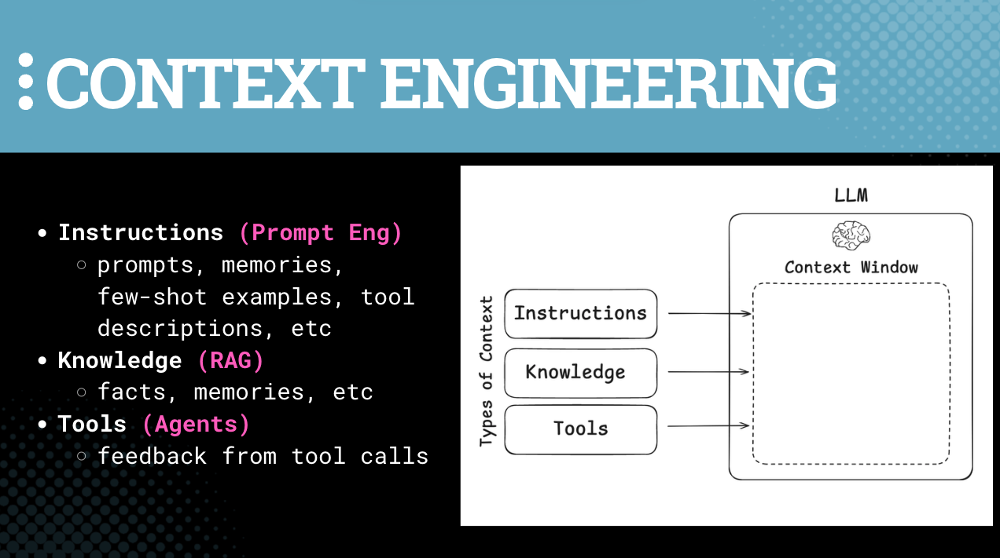

# Session 8: 🔌 MCP

🎯 Understand MCP protocols as well as Agent Skills, and how they all complement each other as different tools in your toolbox

📚 **Learning Outcomes**
- Understand how and when to use MCP
- Learn to set up your own MCP servers
-  MCP vs. Skills: learn to choose the right tool for the job

🧰 **New Tools**
- [Model Context Protocol](https://github.com/modelcontextprotocol)
- [LangChain MCP Adapters](https://github.com/langchain-ai/langchain-mcp-adapters)

## 📛 Required Tooling & Account Setup
- ChatGPT Account (Free version works)

## 📜 Recommended Reading
- [MCP Announcement](https://www.anthropic.com/news/model-context-protocol) (Nov 2024)
- [About MCP](https://modelcontextprotocol.io/docs/getting-started/intro) (from the spec)
- [MCP](https://docs.langchain.com/oss/python/langchain/mcp), by LangChain

# 🗺️ Overview

## 📈 Production-Ready Optimization Strategies

When preparing production-ready, several optimization strategies must be considered:

1. **Asynchronous Requests:** Asynchronous processing is critical for handling the inherent latency from APIs and services such as LLMs. Asynchronous requests allow tasks to run in parallel rather than sequentially, minimizing wait times and improving user experience.

2. **Caching (Prompt and Embedding Caching):** Caching previously used prompts and embeddings can save computational resources and reduce latency. Prompt caching stores past queries and their responses to avoid regenerating answers for identical questions, while embedding caching prevents redundant embedding calculations. This is particularly useful in scenarios where users ask repetitive questions.

3. **Parallel vs. Serialized Chains:** Parallel execution allows multiple tasks to run concurrently, improving overall performance, especially when working with RAG chains where multiple steps like retrieval, augmentation, and inference are involved. Serialized chains process tasks one after another, which can lead to inefficiencies in production environments with high user loads. LangChain natively supports parallel execution where possible.

4. **Calling Chains, Functions, Tools, and APIs:** Production-ready applications often need to orchestrate multiple services, tools, and APIs seamlessly. This includes integrating vector databases for retrieval, orchestrating LLMs, and other third-party APIs. Using frameworks like LangChain simplifies chaining different services together into coherent workflows.

5. **Scalable Vector Databases:** Vector databases, such as Qdrant or other scalable options, are essential for storing and efficiently retrieving embeddings at scale. These databases are optimized to handle large datasets through techniques like Approximate Nearest Neighbor (ANN) search, clustering, and hardware acceleration.

6. **User Sessions and Context Maintenance:** Proper handling of user sessions ensures that multiple users can interact with the system without confusion or data leakage between their sessions.

7. **Streaming Results for Improved UX:** Instead of waiting for the entire response from the LLM, results can be streamed token by token as they are generated. This reduces the perceived latency and allows users to start reading responses as soon as possible.

**As we start to discuss production in the course, we should note that _our tool choices so far get us all of these things off the shelf!_** That is, by choosing the right best-practice tools for prototyping, the boilerplate code we've learned to write in this course will scale with us, assuming we can get user adoption.

With that in mind, let's talk about MCP, which ties our entire prototyping curriculum together quite nicely as we think about deploy and operating our agents in production.

## Setting the Context: Everything is Context Engineering

Before diving into MCP, it helps to trace the arc of what we've learned throughout this course, because MCP is really just the next step in a story we've been telling from the beginning.

We started with **prompt engineering** — the idea from "Language Models are Few-Shot Learners" (2020) — where we built a simple LLM wrapper with a basic input-output schema. Then we leveled up by adding a **retrieval step** (RAG), splitting things into a retriever and a generator to get better outputs. From there, we adapted our patterns to include **tools** and **function calling**, which gave us agents — LLMs that can take actions, not just generate text.

But tools and retrieval aren't the whole picture. **Memory** — both short-term and long-term — is also crucial. Semantic memory maps to facts (classic RAG), episodic memory maps to examples (few-shot), and procedural memory maps to instructions and prompts. When you put it all together, the through-line is clear: **everything is context engineering**. How do we put the good stuff into our app to get the good stuff out? Garbage in, garbage out. Good stuff in, good stuff out.

This is where MCP enters the picture.

## **Model Context Protocol (MCP)**

Model Context Protocol, or MCP, was open-sourced by Anthropic (Nov 2024). The creators of the protocol talk about the backstory [here](https://youtu.be/CQywdSdi5iA?si=RMiWJhJeCYAUZASw&t=195).

> MCP is just my way for putting my workflow into an AI application in a very simple way…It's just a way to give context to an application that uses an LLM; it can be tools, it can be raw context, whatever you'd like it to be. ~ [David Soria Parra](https://x.com/dsp_), Co-Creator of MCP [[Ref](https://www.youtube.com/watch?v=CQywdSdi5iA)]

It exposes three main things: **tools**, **resources** (e.g., raw data), and **prompts**. These map directly onto patterns we already know — agents/tool-calling, RAG/knowledge retrieval, and prompt engineering/instructions. MCP recognizes all of these as forms of context and gives us a standardized protocol for delivering them to models.

  

It is often marketed as the **"USB-C for AI"**: a single, universal plug that lets LLM-powered apps tap live data (calendars, Gmail, Slack, Google Drive, GitHub, etc.). Think of it as a standardized pipe shape — as long as everyone builds pipes that match that shape, we can connect them together with no problems.

MCP was constructed on the same basic idea as [Microsoft's Language Server Protocol](https://microsoft.github.io/language-server-protocol/) — e.g., `A *Language Server* is meant to provide the language-specific smarts and communicate with development tools over a protocol that enables inter-process communication.` Now imagine what Model Context Protocol is!

There has been an adoption snowball driven by a ton of excitement in the industry throughout 2025: first-party servers now from GitHub, Slack, Google, Cursor, etc.; and even OpenAI and Microsoft have announced their support (Mar–Apr 2025).

Recently, [full MCP connectors in ChatGPT](https://help.openai.com/en/articles/12584461-developer-mode-and-full-mcp-connectors-in-chatgpt-beta) came out — meaning organizations can build, test, and deploy MCP-powered connectors that let ChatGPT securely take action in your tools. This is actively something that enterprise clients are interested in, so it is worth knowing.

## MCP: It's a Protocol, Not a Product

A key insight from class: **MCP is a protocol. Tools are tools.** We want to avoid the trap of thinking MCP is some kind of "thing" beyond a protocol — a set of rules for how we can achieve things. The tools already existed; MCP just gives us a standardized way for models to hook into those tools more easily.

Think of it like a restaurant with a multilingual maître d'. The kitchen is making the same food regardless of what language the customer speaks. MCP is the maître d' — it translates the request so that any model can order whatever's on the menu. The underlying tools don't change; only the interface does.

Or, as one memorable description put it: **MCP is an "API for APIs."**

## Using MCP from the Client Side

From the client side, using MCP is straightforward: you connect to an MCP server and get a full set of tools for free, without writing custom API wrappers. In enterprise terminology, this is your **tool loadout** — the set of tools for accomplishing a specific task.

For example, the [GitHub MCP server](https://github.com/github/github-mcp-server) (27K+ stars) exposes dozens of tools that abstract Git commands into natural-language-style function calls. By connecting to this server through the [LangChain MCP Adapters](https://github.com/langchain-ai/langchain-mcp-adapters) library, we can automatically convert all those MCP tools into LangChain-compatible tools. No custom GitHub API wrappers needed — we just get a full set of tools by connecting to the server.

### Two Patterns: API Tools vs. MCP Tools

In today's notebook, we demonstrate both approaches side by side:

1. **API Tool Pattern (X/Twitter):** We manually wrap the X API in custom tool functions (`search_recent_posts`, `get_user_posts`). This makes sense when the API surface is small and well-scoped — a few functions that we know we need.

2. **MCP Tool Pattern (GitHub):** We connect to the GitHub MCP server and ingest all available tools automatically. This makes sense when the tool surface is large (GitHub has 40+ tools) and writing individual wrappers would be tedious. We didn't write a single GitHub tool — we just pulled them all in from MCP.

We then combine both sets of tools into a single LangGraph agent that can search X posts, summarize them, and commit results to a GitHub repo using the MCP workflow.

## The MCP Debate: Pros, Cons, and the Real World

There are genuine differences of opinion about MCP's long-term importance, even within our team.

**The case for MCP:**
- It's easier to get access to MCP servers than to some APIs today, which speeds up development
- Companies are building internal **tool loadout kits** for their organizations, and MCP is the default way they're doing this
- MCP has already captured the market and the public consciousness — clients are actively asking for it
- It allows users to hook up any MCP-compliant service to your agent with minimal friction

**The case for caution:**
- Many early MCP servers were thin wrappers around existing APIs with minimal changes — just a quick way to say "we support MCP." (See Vercel's [critique](https://vercel.com/blog/the-second-wave-of-mcp-building-for-llms-not-developers))
- The "S" in MCP stands for security — which is to say, there is no S. Prompt injection, credentials exposure, and unverified third-party tools are real risks
- As models get more capable, the need for a translation layer may diminish — if models can speak every language, we may not need the maître d'
- For core application features, **skills** (instructing agents how to use tools directly) may be a better pattern than MCP for many use cases

**The bottom line:** MCP is here to stay — at least for enterprise adoption over the next several years. Whether skills, agent-to-agent protocols, or something else eventually overtakes it remains to be seen. Start small, build simply, and ensure you're creating value.

# Building for LLMs (Agents)

Step 1: We must understand that we can *use MCP to interact with agents (LLMs).*

> The question is what do models interact with? *They don't interact directly with APIs*. They interact with prompts and tools and whatever you're giving the model to ingest. MCP standardizes how you take that data and actually give it to the model. ~ Theo Chu [[Ref](https://www.youtube.com/watch?v=CQywdSdi5iA)]

Step 2: We must understand that *when we use MCP to interact with agents (LLMs)*, we must treat them differently than we would a human programmer using APIs or an agent with access to APIs.

In the same way that an API is fully self-contained (e.g., response-request), we want to make sure that *the way we use MCP* is also fully self-contained, because remember, its most likely use is for **other agents**, not humans.

Even in the case that we want a tool loadout to be useful to others in our organization, what we really want isn't simply the access to those tools. What we want instead is that when we engage with a set of tools (or more generally tools, raw data, and prompts), *we are also engaging with a particular process by which we are to leverage them*.

> The solution is building tools around complete user goals rather than API capabilities. Instead of four separate tools, create one **`deploy_project`** tool that handles the entire workflow internally. ~ [The second wave of MCP](https://vercel.com/blog/the-second-wave-of-mcp-building-for-llms-not-developers), by Vercel

Check out this great example starting with "[This changes everything about tool design](https://vercel.com/blog/the-second-wave-of-mcp-building-for-llms-not-developers#:~:text=This%20changes%20everything%20about%20tool%20design%3A)," and note the differences between an "API-shaped MCP server" and an "intention-based MCP server."

In the end, we should be designing workflow-based MCP tools. As we've seen throughout this course, it's not just dumb input-output, and it's also not just pure chaotic agency. All agentic systems include workflows and agents.

# Conclusions

> Think of MCP tools as tailored toolkits that help an AI achieve a particular task, not as API mirrors.

> MCP works best when tools reflect complete user goals.

> Protocols are protocols. Tools are tools.

Build with MCP when building for agents, not humans. And remember — everything comes back to context engineering: getting the right information to the model so it can produce the best possible output.

# PS - On Security

The S in MCP stands for security. Of course, there's no S.

As [Palo Alto Networks explains](https://www.paloaltonetworks.com/blog/cloud-security/model-context-protocol-mcp-a-security-overview/?utm_source=chatgpt.com), there are several risks that are immediately evident: prompt injection, credentials exposure, and unverified third-party tools.

Correspondingly, a few best practices exist, including great logging, org-specific governance procedures for your company's use of MCP servers, and ensuring that API keys stay hidden.

There is, of course, a ton of security work to be done in a world run by agents. As with all things, start small, build simply, and ensure you're creating value.

### 🕳️ Go Deeper

- Listen to [the entire overview](https://www.youtube.com/watch?v=CQywdSdi5iA) by the co-creator of MCP with Anthropic
- Take a look at the actual [Technical Specification](https://modelcontextprotocol.io/specification/2025-06-18) of MCP
