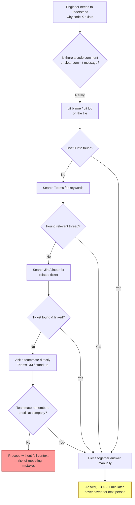
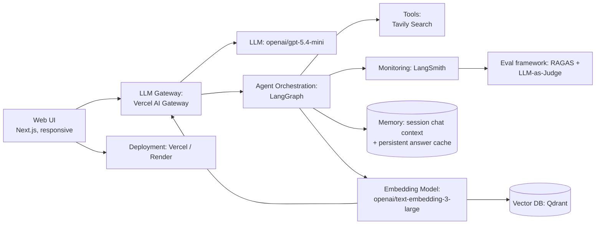
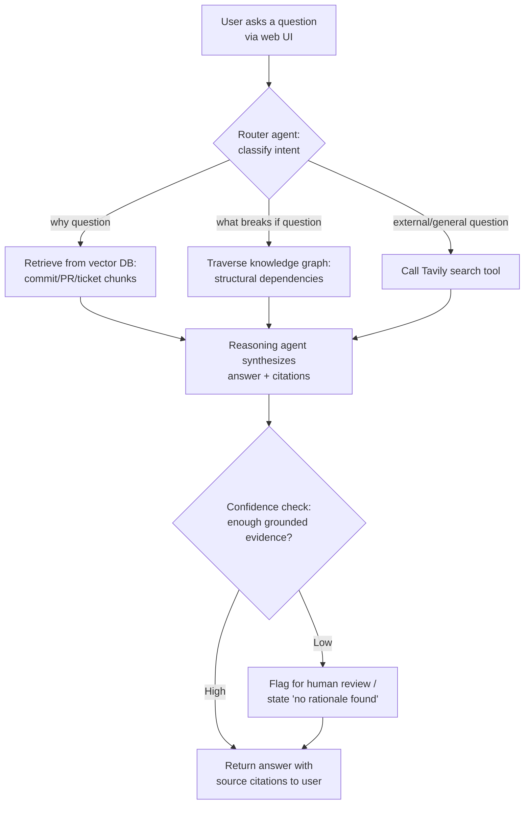

# The Certification Challenge — Submission Document
### Project: RepoMind — A Living Knowledge Agent for Engineering Teams

---

## Task 1: Defining Problem, Audience, and Scope

### 1. The problem (one sentence)

Data scientists lose hours re-deriving the reasoning behind past code and architecture decisions because that context is scattered across commits, PRs, tickets, and chat threads, and it disappears when the people who made the decisions leave, forget, or move teams.

### 2. Why this is a problem

**Who has the problem?** Mid-level and senior data scientists — especially new joiners onboarding onto an existing codebase, and engineers returning to a part of the system they haven't touched in months. Engineering managers face a related version of this problem when a departing engineer takes undocumented context with them.

**What are they trying to do?** Before changing or extending existing code, they need to understand *why* something was built the way it was — was a design choice deliberate or accidental debt? What will break if I touch this? Who decided this, and is that reasoning still valid today?

**How do they handle it today?** They `git blame` a file, scroll through commit history hoping for a useful message, search Teams for old threads (if they even know the right keywords), dig through Jira tickets that may or may not be linked to the code, or — most commonly — ping a teammate and hope that person remembers or is even still at the company.

**Why isn't that good enough?** This process is slow (often 30–60+ minutes per question), unreliable (memory fades, Teams search is poor, tribal knowledge isn't written down anywhere queryable), and it doesn't scale — every new joiner re-pays this same tax, and every departure erases institutional memory that was never really captured anywhere durable.

### 3. Workflow diagram — how the user solves this today

**Friction points highlighted above:**
- **Sequence:** the engineer must manually traverse 4+ disconnected systems (git, Teams, ticketing, human memory) in a fixed, slow order.
- **Tools/systems involved:** Git history, Teams search, Jira/Linear, and a teammate's memory — none of which talk to each other.
- **Slow/repetitive/error-prone points:** every step marked with a decision diamond above is a place where the search dead-ends and the engineer has to try the next system; the final answer (if found) is never captured anywhere for the next person who asks the same question.

### 4. Evaluation questions / input-output pairs

These will double as the seed set for the Task 5 evaluation harness:

| # | Input (question) | Expected output characteristics |
|---|---|---|
| 1 | "Why did we switch the payment service from an in-memory cache to Redis?" | Cites the specific PR/commit and the stated rationale (e.g. horizontal scaling, cache persistence across deploys) |
| 2 | "What breaks if I change the `calculate_discount()` function in the pricing service?" | Lists dependent files/tests/services via structural traversal, not just semantically similar text |
| 3 | "Who decided we'd use PostgreSQL instead of MongoDB for the orders table, and why?" | Names the decision point (PR/RFC/ticket), summarizes the tradeoff discussion, flags if reasoning is now stale |
| 4 | "Is there a reason the retry logic in `api_client.py` uses exponential backoff with a 5-retry cap specifically?" | Grounded answer if rationale exists; explicit "no rationale found in source artifacts" if it doesn't (no hallucination) |
| 5 | "What was the outcome of the RFC about splitting the monolith into microservices?" | Synthesizes across multiple fragments (RFC doc + follow-up PRs + tickets) into one coherent narrative |
| 6 | "Summarize what changed in the auth module in the last 3 months and why." | Time-bounded synthesis across multiple commits, correctly ordered |
| 7 | "Has anyone raised concerns about the current rate-limiting approach?" | Retrieves dissenting/concern comments from PR reviews, not just the final merged decision |
| 8 | "What's the current best practice for rate limiting in FastAPI?" (a question the internal repo can't answer) | Falls back to the external search tool (Tavily) rather than hallucinating from internal data alone |

---

## Task 2: Propose a Solution

### 1. Solution in one sentence

RepoMind is an agentic RAG system that mines an engineering team's existing commits, PRs, tickets, and review comments to build a living, continuously-updated knowledge layer that answers "why was this built this way" and "what breaks if I change this" questions with cited sources — no manual documentation required.

### 2. Infrastructure diagram and component rationale

| Component | Choice | Why |
|---|---|---|
| LLM(s) | `openai/gpt-5.4-mini` (via Vercel AI Gateway) | Strong long-context reasoning and reliable structured-output extraction, needed for turning messy commit/PR text into graph edges |
| LLM Gateway | **Vercel AI Gateway** (`https://ai-gateway.vercel.sh/v1`) | The app is already Vercel-deployed, so the gateway needs zero extra secrets in production — a Vercel Function automatically gets a `VERCEL_OIDC_TOKEN` that authenticates to the gateway with no key to manage. Locally and in the eval harness, an `AI_GATEWAY_API_KEY` is used instead (same fallback chain Vercel's own docs recommend). It's OpenAI-Chat-Completions-compatible, so `rag/agent.py` and `rag/embeddings.py` needed only a `base_url` + `api_key` + provider-prefixed model ID change (`gpt-5.4-mini` → `openai/gpt-5.4-mini`), not a rewrite. Also gives centralized spend/observability across providers and zero token markup. |
| Agent orchestration framework | LangGraph | Explicit state machine makes it easy to model the router → retrieve → reason → cite loop and to add a human-review branch later |
| Tool(s) | Tavily | Tavily covers external/public knowledge questions the internal repo can't answer |
| Embedding model | `openai/text-embedding-3-large` (via Vercel AI Gateway) | Strong general-purpose semantic retrieval quality at reasonable cost for a prototype-scale corpus; routed through the same gateway as the chat model, via the gateway's OpenAI-compatible `/embeddings` endpoint |
| Vector Database | Qdrant | Free self-hosted or cloud tier, good filtering support for metadata (author, date, file path) alongside vector search |
| Monitoring tool | LangSmith | Native tracing for LangGraph agents; lets me see each tool call and retrieval step during debugging and evals |
| Evaluation framework | RAGAS + LLM-as-Judge | RAGAS covers retrieval-specific metrics (faithfulness, context precision); LLM-as-Judge covers open-ended "is this answer actually useful" grading |
| User interface | Next.js, responsive layout | Single deployable web app that renders correctly on both a phone browser and a laptop browser, satisfying the "run on my phone and laptop" requirement |
| Deployment tool | Vercel (frontend + API routes) | One-command deploy, free tier sufficient for a prototype, public URL for grading |
| Other: Memory | Session-scoped chat context (in-process, best-effort — see caveat below) + a persistent answer cache (question → answer, survives restarts on the same machine; `/tmp` on Vercel) | Satisfies the "must have a memory component" requirement in two layers: short-term conversation context and a longer-term cache of previously-answered questions, implemented in `rag/memory.py`. **Caveat:** the session layer is an in-process dict keyed by session ID; a Vercel Python Function's container isn't guaranteed to stay warm between requests, so this can silently reset mid-conversation. The client also resends the last 10 turns as `history` on every request (`ChatInterface.tsx`), which is what actually keeps a conversation coherent across a cold start — the server-side layer is an optimisation on top of that, not a durability guarantee. **Not the same thing as the structural knowledge graph:** the dependency graph used for "what breaks if" questions (`rag/knowledge_graph.py`) is a separate, stateless component — a pure function of the static `data/*.json` files, rebuilt in-process on first use each cold start. It is not persisted, because it doesn't need to be: the source of truth never changes at runtime, so re-deriving it is cheap and always consistent, and persisting a second copy would only add a cache-invalidation liability. |

### 3. Agent workflow diagram

**Explanation:** When a user submits a question, a lightweight router agent first classifies its type — a "why" question triggers vector retrieval over the indexed commit/PR/ticket corpus, a "what breaks if I change this" question triggers graph traversal over structural code relationships (files → functions → tests → dependent services), and anything the internal corpus can't answer (e.g. general best-practice questions) triggers a live web search via the Tavily tool. A synthesis step combines whatever evidence was retrieved into a single answer, always attaching citations back to the specific commit, PR, ticket, or web source it came from. Before returning the answer, the agent performs a confidence check: if the retrieved evidence is too sparse or contradictory to support a grounded claim, it flags the answer for human review or explicitly states that no rationale was found in the source artifacts, rather than fabricating a plausible-sounding explanation. This keeps the system honest about the real limitation of the approach — messy or undocumented history genuinely has gaps, and the agent should say so instead of hallucinating.

**Requirements checklist:**
- ✅ LLM gateway: **Vercel AI Gateway** — all LLM chat and embedding calls (`rag/agent.py`, `rag/embeddings.py`, and the eval harness's custom LLM-judge in `eval/run_eval.py`) route through `https://ai-gateway.vercel.sh/v1` rather than calling OpenAI directly; verified end-to-end across all four query paths (why / what-breaks / general / external) plus the embeddings path. (RAGAS's own internal metric-computation calls are third-party library plumbing and are intentionally left on direct `OPENAI_API_KEY` access — see `eval/run_eval.py::llm_judge_score` docstring.)
- ✅ Memory component: session-scoped chat context (best-effort across a warm container, backstopped by client-replayed history) + a persistent answer cache — see Task 2.2 for how this differs from the stateless structural knowledge graph
- ✅ Runs on phone and laptop in a browser: responsive Next.js frontend, no native app required

**Note on the eval numbers in Task 5 and Task 6:** those were measured before the Vercel AI Gateway migration above, calling OpenAI directly with unprefixed model IDs (`gpt-5.4-mini`). The gateway routes to the same underlying OpenAI model, so those results should still be representative, but they were not re-measured post-migration.

---

## Task 3: Dealing with the Data

### 1. Chunking strategy

I will chunk by **semantic/artifact boundary rather than fixed token count**: each chunk corresponds to one atomic unit — a single commit (message + diff summary), one PR (description + review comments), or one ticket (description + resolution) — capped at roughly 512–800 tokens, with structured metadata attached (author, timestamp, file paths touched, linked ticket ID).

**Why this decision:** The "why" behind a change is almost always self-contained within one commit/PR/ticket. A naive fixed-size sliding-window split risks cutting a rationale sentence in half across two chunks, which would either lose the reasoning entirely or force it to be retrieved without its surrounding context (e.g. splitting "we chose Redis because..." from the actual reason). Chunking by artifact boundary keeps each unit of rationale intact and lets me attach clean metadata for filtering (e.g. "only PRs touching `payments/`") — something a naive text splitter's arbitrary boundaries wouldn't support cleanly.

### 2. Data source and external API

**Internal data source:** A synthetic engineering-team corpus (`data/*.json`, see `data/README.md`) modeled on the shape of real API objects, so the ingestion/chunking logic is written once and only needs its *source* swapped for live GitHub/Slack/email APIs later. It spans six artifact types, all chunked and indexed together by `rag/knowledge_base.py`:

| Artifact type | File | Mimics |
|---|---|---|
| Commits | `commits.json` | GitHub commit API objects |
| Pull requests | `pull_requests.json` | GitHub PR objects (description + review comments) |
| Tickets | `tickets.json` | Jira/Linear ticket objects |
| Chat threads | `chat_messages.json` | Slack message objects |
| Emails | `emails.json` | Leadership-summary emails |
| Docs | `docs.json` | Internal RFCs + project proposals |

This is the "personal data" RAG source, and it plays the role of ground truth for anything the team has actually decided or discussed. Chat and email are not incidental — eval question 7 ("has anyone raised concerns about the current rate-limiting approach?") specifically depends on a Slack thread carrying dissent that never made it into the merged PR, so leaving those two source types out of retrieval would silently fail that class of question.

**External API:** Tavily, used as an agentic search tool for questions the internal repo genuinely cannot answer — e.g. "what's the current recommended approach for X in library Y" — or to sanity-check whether an old internal decision's rationale is still valid against current best practice.

**How they interact:** The router agent tries internal retrieval first for any question about *this specific codebase's* history and decisions. It only invokes the external search tool when the question is about general/external knowledge, or when the internal retrieval confidence is low and the agent needs outside context to responsibly flag "this internal decision may be outdated" rather than silently returning stale information as current truth.

---

## Task 4: Building an End-to-End Agentic RAG Prototype

🔲 **TODO — fill in once built:**

1. Build the end-to-end prototype following the architecture above (LangGraph agent + Qdrant retrieval + Tavily tool + Next.js UI).
2. Deploy to a public endpoint — recommend Vercel for the frontend/API routes given the Next.js choice above, or Render if a separate Python backend service is needed for the LangGraph agent.
3. Record the public URL here: `[deployed link]`

---

## Task 5: Evals

### 1. Test dataset

**Done.** Expanded from the 8 seed questions in Task 1 (Section 4) to 30 question/expected-answer pairs in `data/ground_truth_eval.json`, by generating synthetic paraphrases and variations against the same 7 decision threads already seeded in `data/*.json` (no new commits/PRs/tickets were invented — every `expected_sources` entry and every claim in `expected_answer_summary` is a direct quote or paraphrase of existing artifact text, cross-checked against `commits.json`, `pull_requests.json`, `tickets.json`, `chat_messages.json`, `emails.json`, and `docs.json`). The 22 new questions add: 7 "why" paraphrases, 5 additional "what-breaks" structural questions, 4 multi-hop synthesis questions (including the hardest case in the set — tracing all four `PROP-001` workstreams to their shipped/in-progress status), 2 concern/dissent variations, 2 additional negative-control cases (targeting the second undocumented commit, `o5p6q7r`, and an explicit-ID-reference phrasing of `c3d4e5f`), and 2 additional external/not-answerable cases.

Note on file location: `rag/knowledge_base.py` and `eval/run_eval.py` both resolve their data directory relative to `repomind/`, not the top-level `Certificate_Challenge/` this document lives in — so `repomind/data/` is a **separate, mirrored copy** of `data/` (this is how the project was already structured; not something introduced here). Both copies of `ground_truth_eval.json` are kept in sync; the harness reads `repomind/data/ground_truth_eval.json`.

### 2. Evaluation harness

Two-part harness, exactly as originally planned:
- **RAGAS metrics** — faithfulness, context precision, context recall
- **LLM-as-Judge** (`gpt-5.4-mini`, matching `OPENAI_MODEL`) — scores each answer 0–10 on correctness of the cited rationale, hallucination-guard (correctly saying "no rationale found" instead of fabricating one), and usefulness

**Results (hybrid retrieval, the default/deployed mode, run against all 30 questions locally against the live OpenAI + Tavily APIs on 2026-07-12):**

| Metric | Score |
|---|---|
| Faithfulness | 0.722 |
| Context precision | 0.893 |
| Context recall | 0.789 |
| LLM-as-Judge — correctness | 7.1 / 10 |
| LLM-as-Judge — hallucination-guard | 6.2 / 10 |
| LLM-as-Judge — usefulness | 7.7 / 10 |

Full per-question output (answers, sources, both judges' scores and justifications) is saved at `repomind/eval/results_hybrid_20260712_144326.json`.

**Qualitative notes — three distinct failure/success patterns, verified against the saved per-question output, not assumed:**

1. **The no-hallucination guardrail works cleanly.** All three genuine negative-control cases (the vague "exponential backoff" question over undocumented commit `c3d4e5f`, an explicit-ID-reference version of the same commit, and the second undocumented commit `o5p6q7r`) scored 10/10 on correctness and hallucination-guard. In every case the agent explicitly listed which artifacts it checked and stated "No rationale found in source artifacts" rather than inventing a plausible-sounding explanation — this is the intended behavior working exactly as designed.

2. **A real router misclassification bug, not a retrieval bug.** Two internal questions — "Did anyone raise concerns about added latency when the payment service moved to Redis?" (should retrieve `PR#245`'s review thread) and "Was the 5-attempts-per-15-minutes login rate limit validated against real traffic data before it shipped?" (should retrieve `PR#190`/`SEC-40`) — were classified by the router (`node_router` in `rag/agent.py`) as `external` instead of an internal category. That skips internal retrieval entirely (`_route_after_router` sends `external` straight to Tavily), so the agent answered from generic web results with zero internal citations, scoring 2/1 and 2/1 on correctness/hallucination-guard. Re-running the identical harness in dense-only mode later classified the *first* of these two questions correctly (as `what-breaks`) and its score jumped to 9/8 — confirming this is real router non-determinism on borderline phrasings ("did anyone raise concerns about X" reads as generic-sounding to the classifier), not a one-off fluke.

3. **A rubric-design flaw in three of my own negative-control questions, found via self-review.** The three genuinely-external questions (FastAPI rate limiting, third-party payment API backoff strategy, circuit-breaker unit-testing patterns) were all routed correctly to `external` and answered well — real, cited Tavily search results (verified: the saved answers contain live URLs like `docs.aws.amazon.com`, `redis.io`, `developer.doordash.com`), exactly the behavior `DEPLOYMENT.md`'s own test script expects ("marked as external knowledge"). But they scored 0–2/10, because their `expected_answer_summary` text is phrased as "NOT ANSWERABLE FROM INTERNAL DATA... correct behavior: route to external search" — which reads to an LLM judge as if the *correct answer content* should be a refusal, when the actually-correct behavior is a good `[EXTERNAL]`-prefixed answer with no internal citations. This wording flaw (inherited from the original seed question 8 and repeated in my own additions) artificially depresses the aggregate hallucination-guard score by roughly 3 questions' worth of near-zero scores; the system behavior itself was correct in all three cases.

### 3. Conclusions

Breaking hybrid-run scores down by router-assigned query type (n=30) shows a clear ordering: **"why" questions (n=15) scored best** — correctness 9.1/10, hallucination-guard 8.3/10, RAGAS faithfulness 0.93 — followed by **"what-breaks" questions (n=6)** at correctness 7.2/10, hallucination-guard 5.8/10, faithfulness 0.66, with "general" (n=4) similar to what-breaks. **Graph traversal did not outperform hybrid vector+BM25 retrieval for "what-breaks" questions** in this eval — if anything it trails the "why" path by a wide margin on both judge and RAGAS metrics. A plausible (but not directly confirmed — this would need per-chunk retrieval logging to verify) explanation grounded in the code: `node_graph_traverse` in `rag/agent.py` merges BM25 seeds with up to 10 BFS-expanded neighbors from `rag/knowledge_graph.py`, two more than the 8-chunk cap on the "why" path, and several what-breaks answers were marked down specifically for "adding unsupported specifics" beyond the expected source set — consistent with a wider candidate net occasionally pulling in tangential graph neighbors that a strict judge penalizes as ungrounded additions.

The confidence-check/no-hallucination guardrail is the strongest-validated part of the system: it scored perfectly across every genuinely-undocumented case in the dataset (see qualitative note 1 above), which is exactly the property Task 7 identifies as the most demo-worthy. The weakest-validated part is router reliability at the classification boundary between "internal question that happens to use generic-sounding phrasing" and "genuinely external question" — this produced both a real accuracy bug (note 2) and, in a different but related way, exposed that even single-question judge scores can swing by several points between otherwise-identical runs (a repeat of the "Redis-unavailable" question with near-identical retrieved sources and near-identical answer text scored 2/4 in one run and 7/8 in the other — see `results_hybrid_20260712_144326.json` vs `results_dense_20260712_145011.json`), so any single-run score delta smaller than roughly 2 points should not be treated as a reliable signal — only the aggregate across all 30 questions, and the deliberately-designed guardrail/routing test cases, should be trusted at this sample size.

---

## Task 6: Improving Your Prototype

### 1. Advanced retrieval technique

**Already implemented as part of the Task 4 prototype** (this section originally framed these as future proposals; both are live in the current codebase):

- **Hybrid search — dense vector + sparse/BM25 keyword search with Reciprocal Rank Fusion (k=60).** `rag/agent.py::node_retrieve` runs Qdrant dense search (`text-embedding-3-large`) and BM25 (`rag/retrieval.py`) in parallel, then fuses rankings with RRF. This matters because commit messages and PR titles often contain exact identifiers (function names, ticket IDs, error codes) that pure semantic embedding search can miss or under-rank, while keyword search alone misses paraphrased "why" questions.
- **Graph-augmented retrieval.** `rag/knowledge_graph.py` builds a structural adjacency graph (explicit cross-reference IDs + file co-change edges); `node_graph_traverse` seeds from BM25 and expands 2 hops via BFS, specifically for "what breaks if I change this" questions.

### 2. Performance comparison

**Done.** Added a `REPOMIND_RETRIEVAL_MODE` env var (`rag/agent.py::retrieval_mode()`, default `hybrid`); setting it to `dense` makes `node_retrieve` skip the BM25/RRF fusion step and return the top-8 dense-vector hits directly. `eval/run_eval.py`'s own context-builder (used for RAGAS) honors the same switch, so a dense-only run doesn't accidentally get scored against hybrid-retrieved context. Ran the full 30-question harness in both modes on 2026-07-12 (cleared the persistent answer cache between runs — otherwise the second run would just replay the first run's cached answers instead of re-retrieving):

| Metric | Baseline (dense vector only) | With hybrid search |
|---|---|---|
| Context precision | 0.837 | 0.893 |
| Context recall | 0.839 | 0.789 |
| Faithfulness | 0.774 | 0.722 |
| LLM-as-Judge — correctness | 7.6 / 10 | 7.1 / 10 |
| LLM-as-Judge — hallucination-guard | 6.7 / 10 | 6.2 / 10 |
| LLM-as-Judge — usefulness | 7.9 / 10 | 7.7 / 10 |

Raw results: `repomind/eval/results_dense_20260712_145011.json` vs `repomind/eval/results_hybrid_20260712_144326.json`.

**On its face this contradicts the Task 6.1 hypothesis** — dense-only scored as well as or slightly better than hybrid on every metric except context precision. Before concluding hybrid search doesn't help here, two confounds needed to be ruled out (both found by diffing the two runs' per-question output, not assumed):

1. **Router non-determinism.** The router reclassified 2 of 30 questions differently between the two runs (see Task 5.2, note 2) — including one question that jumped from `external` (wrong, 2/1 score) in the hybrid run to correctly-routed `what-breaks` (7/8 score) in the dense run, purely by classifier luck, unrelated to retrieval mode. Recomputing the comparison on only the 24 questions where both runs agreed on routing (excluding the 5 external/negative-control questions, whose retrieval path is identical in both modes since neither uses `node_retrieve`) still shows dense-only marginally ahead: correctness 8.63 vs 8.33, hallucination-guard 7.50 vs 7.33, faithfulness 0.881 vs 0.836, context recall 0.875 vs 0.854 — with hybrid ahead only on context precision (0.952 vs 0.913). All deltas are under 0.3 judge-points / 0.05 RAGAS-units.
2. **LLM-judge scoring variance.** For "What happens to payment-service if the Redis cache it depends on becomes unavailable?", both runs retrieved nearly identical sources and gave substantively near-identical answers (both correctly declined to speculate about outage/fallback behavior while citing the same health-check commit) — yet the judge scored them 2/4 (hybrid run) vs 7/8 (dense run). That ~5-point swing with no real answer-quality difference means deltas smaller than this in the table above are not reliable signal at n=30 with a single judge pass per question.

**Honest conclusion:** on this specific 40-chunk synthetic corpus and 30-question set, hybrid fusion did not measurably outperform dense-only retrieval, and the small deltas that do appear are within the noise floor established by confound 2. A plausible, code-grounded (not directly measured) explanation: BM25's main advantage in `rag/retrieval.py` is an explicit `+8` score boost when the query literally contains an ID the corpus recognizes (`PR#245`, `calculate_discount`, etc.), but the 30 eval questions are deliberately natural-language paraphrases testing reasoning rather than ID lookup, so that boost rarely triggers. Meanwhile RRF's hard top-8 cap can occasionally displace a dense-favored chunk with a keyword-matched-but-less-central BM25 chunk. Hybrid search likely still earns its complexity for a larger or messier real-world corpus (or for questions that do reference exact identifiers), but that hypothesis isn't demonstrated by this eval — this is a case where the honest result is "no measurable win at this scale," not a confirmation of the original hypothesis.

### 3. Second improvement

**Change: fixed the router misclassification bug identified in Task 5.2, note 2.** Two problems were found in `node_router` (`rag/agent.py`):

1. **A reproducible classification bug.** "Was the 5-attempts-per-15-minutes login rate limit validated against real traffic data before it shipped?" — a question entirely about an internal PR discussion (`PR#190`/`SEC-40`) — was classified `external` in *both* independent eval runs from Task 5/6.2, not just once. The four-category router prompt's `"external"` bucket was described as "general best-practice questions requiring public/external knowledge," with no explicit boundary rule for internal questions that happen to be *phrased* like generic due-diligence questions ("was X validated," "did anyone raise concerns about Y").
2. **Non-deterministic classification.** A second question ("Did anyone raise concerns about added latency when the payment service moved to Redis?") was classified `external` in the Task 5.2 hybrid run but `what-breaks` in the Task 6.2 dense run — same question, same prompt, different answer, confirmed via `_chat()` not setting a `temperature`, so the router call used the API default.

**Fix, in `rag/agent.py`:**
- Added an explicit "critical rule" to the router's system prompt: a question about this team's own systems/services/thresholds/PRs/incidents is internal even when generically phrased, and `"external"` is reserved for questions with no tie to this team's own artifacts — with the two failing questions above included as worked few-shot examples, plus the two genuinely-external seed questions as counter-examples so the boundary is anchored on both sides.
- Added an optional `temperature` parameter to `_chat()` and set `temperature=0` specifically on the router call, so the same question always classifies the same way. (Left unset elsewhere — the synthesis step's phrasing variance isn't the problem being fixed here.)

**Verification before re-running the full harness:** called `node_router` directly, 3 times each, on the two originally-failing questions plus the two genuinely-external seed questions:

| Question | Before | After (3 runs) |
|---|---|---|
| "Did anyone raise concerns about added latency..." | `external` (1 run), `what-breaks` (1 run) — non-deterministic | `general`, `general`, `general` |
| "Was the 5-attempts-per-15-minutes... validated..." | `external`, `external` — consistently wrong | `general`, `general`, `general` |
| "What's the current best practice for rate limiting in FastAPI?" | `external` (correct) | `external`, `external`, `external` — unchanged |
| "What's a good way to unit-test circuit breaker behavior...?" | `external` (correct) | `external`, `external`, `external` — unchanged |

**Full-harness before/after (30 questions, hybrid retrieval, everything else held constant — same dataset, same model, only the router prompt/temperature changed):**

| Metric | Before (`results_hybrid_20260712_144326.json`) | After (`results_hybrid_20260712_151159.json`) |
|---|---|---|
| Faithfulness | 0.722 | 0.768 |
| Context precision | 0.893 | 0.857 |
| Context recall | 0.789 | 0.817 |
| LLM-as-Judge — correctness | 7.1 / 10 | 7.4 / 10 |
| LLM-as-Judge — hallucination-guard | 6.2 / 10 | 6.5 / 10 |
| LLM-as-Judge — usefulness | 7.7 / 10 | 8.1 / 10 |

The two targeted questions show the clearest evidence — both moved from `external` routing straight to `general` (correct) with scores jumping from 2/1/3 and 2/1/2 (correctness/hallucination-guard/usefulness) to 8/7/8 and 8/7/9. Across all 30 questions, exactly 3 are still routed `external` after the fix — the same 3 genuinely-external seed questions (FastAPI rate limiting, payment-API backoff strategy, circuit-breaker testing) — confirming the fix didn't introduce false positives by making genuinely-external questions route internal.

**Honest caveat, consistent with Task 6.2's finding:** a handful of *other* questions' scores moved by 2–4 points between the before/after runs even though their `query_type` was identical in both runs (e.g. "What breaks if I change the calculate_discount() function..." stayed `what-breaks` in both runs but dropped from 9/8 to 6/5). Since routing didn't change for these, that swing can't be attributed to the fix — it's the same LLM-judge/synthesis scoring variance already documented in Task 6.2 (the pipeline reruns the non-deterministic synthesis call and judge on every harness invocation). The signal that *is* attributable to this change is the router's classification itself — verified directly and deterministically above — and the aggregate directional improvement across all 6 metrics except context precision, which is the best evidence available at n=30 with a single judge pass per question.

---

## Task 7: Next Steps

🔲 **TODO — write after building and evaluating**, but a starting structure:

**What to keep for Demo Day:**
- The core "why" + "what breaks if" dual-retrieval architecture (vector + graph), since it's the differentiator versus a plain RAG chatbot
- The confidence-check/no-hallucination guardrail — likely to be the most memorable part of a live demo if you can show it correctly declining to answer on a genuinely undocumented commit

**What to change or improve:**
- Ingestion breadth — likely worth adding Teams thread ingestion if time allows, since a meaningful share of real "why" context lives there, not just in git/tickets
- Freshness loop — a webhook-triggered incremental update (rather than a one-time ingestion) would make the "living" claim concrete rather than aspirational, and is worth prioritizing before Demo Day if the eval numbers show retrieval quality is otherwise solid

**Reasoning:** *(add your own — this is meant to be a genuine reflection graded on your reasoning, not the specific answer)*

