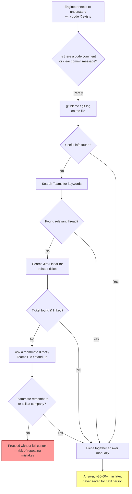
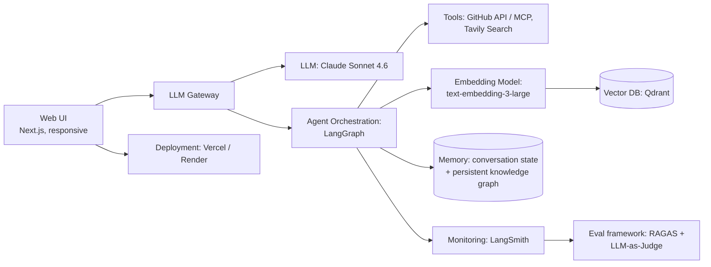
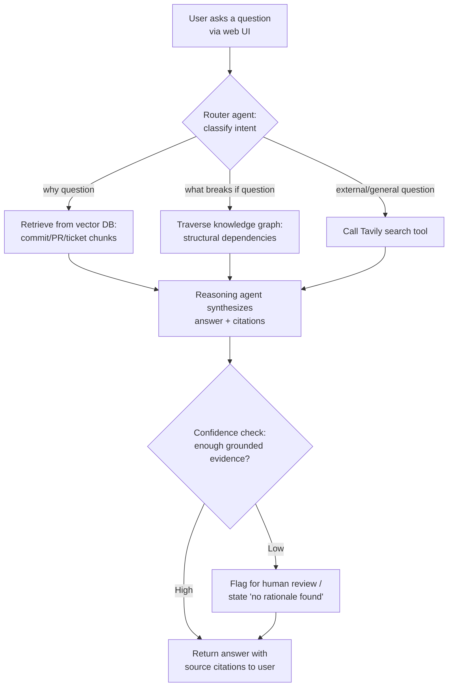

# The Certification Challenge — Submission Document
### Project: RepoMind — A Living Knowledge Agent for Engineering Teams

---

## Task 1: Defining Problem, Audience, and Scope

### 1. The problem (one sentence)

Data scientists lose hours re-deriving the reasoning behind past code and architecture decisions because that context is scattered across commits, PRs, tickets, and chat threads, and it disappears when the people who made the decisions leave, forget, or move teams.

### 2. Why this is a problem

**Who has the problem?** Mid-level and senior data scientists — especially new joiners onboarding onto an existing codebase, and engineers returning to a part of the system they haven't touched in months. Engineering managers face a related version of this problem when a departing engineer takes undocumented context with them.

**What are they trying to do?** Before changing or extending existing code, they need to understand *why* something was built the way it was — was a design choice deliberate or accidental debt? What will break if I touch this? Who decided this, and is that reasoning still valid today?

**How do they handle it today?** They `git blame` a file, scroll through commit history hoping for a useful message, search Teams for old threads (if they even know the right keywords), dig through Jira tickets that may or may not be linked to the code, or — most commonly — ping a teammate and hope that person remembers or is even still at the company.

**Why isn't that good enough?** This process is slow (often 30–60+ minutes per question), unreliable (memory fades, Teams search is poor, tribal knowledge isn't written down anywhere queryable), and it doesn't scale — every new joiner re-pays this same tax, and every departure erases institutional memory that was never really captured anywhere durable.

### 3. Workflow diagram — how the user solves this today

**Friction points highlighted above:**
- **Sequence:** the engineer must manually traverse 4+ disconnected systems (git, Teams, ticketing, human memory) in a fixed, slow order.
- **Tools/systems involved:** Git history, Teams search, Jira/Linear, and a teammate's memory — none of which talk to each other.
- **Slow/repetitive/error-prone points:** every step marked with a decision diamond above is a place where the search dead-ends and the engineer has to try the next system; the final answer (if found) is never captured anywhere for the next person who asks the same question.

### 4. Evaluation questions / input-output pairs

These will double as the seed set for the Task 5 evaluation harness:

| # | Input (question) | Expected output characteristics |
|---|---|---|
| 1 | "Why did we switch the payment service from an in-memory cache to Redis?" | Cites the specific PR/commit and the stated rationale (e.g. horizontal scaling, cache persistence across deploys) |
| 2 | "What breaks if I change the `calculate_discount()` function in the pricing service?" | Lists dependent files/tests/services via structural traversal, not just semantically similar text |
| 3 | "Who decided we'd use PostgreSQL instead of MongoDB for the orders table, and why?" | Names the decision point (PR/RFC/ticket), summarizes the tradeoff discussion, flags if reasoning is now stale |
| 4 | "Is there a reason the retry logic in `api_client.py` uses exponential backoff with a 5-retry cap specifically?" | Grounded answer if rationale exists; explicit "no rationale found in source artifacts" if it doesn't (no hallucination) |
| 5 | "What was the outcome of the RFC about splitting the monolith into microservices?" | Synthesizes across multiple fragments (RFC doc + follow-up PRs + tickets) into one coherent narrative |
| 6 | "Summarize what changed in the auth module in the last 3 months and why." | Time-bounded synthesis across multiple commits, correctly ordered |
| 7 | "Has anyone raised concerns about the current rate-limiting approach?" | Retrieves dissenting/concern comments from PR reviews, not just the final merged decision |
| 8 | "What's the current best practice for rate limiting in FastAPI?" (a question the internal repo can't answer) | Falls back to the external search tool (Tavily) rather than hallucinating from internal data alone |

---

## Task 2: Propose a Solution

### 1. Solution in one sentence

RepoMind is an agentic RAG system that mines an engineering team's existing commits, PRs, tickets, and review comments to build a living, continuously-updated knowledge layer that answers "why was this built this way" and "what breaks if I change this" questions with cited sources — no manual documentation required.

### 2. Infrastructure diagram and component rationale

| Component | Choice | Why |
|---|---|---|
| LLM(s) | Claude Sonnet 4.6 (via API) | Strong long-context reasoning and reliable structured-output extraction, needed for turning messy commit/PR text into graph edges |
| LLM Gateway | Portkey (or OpenRouter) | Lets me swap/AB-test models without rewriting app code, and gives centralized rate-limit/cost tracking for free |
| Agent orchestration framework | LangGraph | Explicit state machine makes it easy to model the router → retrieve → reason → cite loop and to add a human-review branch later |
| Tool(s) | GitHub API/MCP server, Tavily | GitHub tool pulls live diffs/PR metadata beyond what's indexed; Tavily covers external/public knowledge questions the internal repo can't answer |
| Embedding model | OpenAI `text-embedding-3-large` | Strong general-purpose semantic retrieval quality at reasonable cost for a prototype-scale corpus |
| Vector Database | Qdrant | Free self-hosted or cloud tier, good filtering support for metadata (author, date, file path) alongside vector search |
| Monitoring tool | LangSmith | Native tracing for LangGraph agents; lets me see each tool call and retrieval step during debugging and evals |
| Evaluation framework | RAGAS + LLM-as-Judge | RAGAS covers retrieval-specific metrics (faithfulness, context precision); LLM-as-Judge covers open-ended "is this answer actually useful" grading |
| User interface | Next.js, responsive layout | Single deployable web app that renders correctly on both a phone browser and a laptop browser, satisfying the "run on my phone and laptop" requirement |
| Deployment tool | Vercel (frontend + API routes) | One-command deploy, free tier sufficient for a prototype, public URL for grading |
| Other: Memory | Conversation memory (session-scoped) + persistent knowledge graph (project-scoped, survives across sessions) | Satisfies the "must have a memory component" requirement in two layers: short-term chat context and long-term project knowledge |

### 3. Agent workflow diagram

**Explanation:** When a user submits a question, a lightweight router agent first classifies its type — a "why" question triggers vector retrieval over the indexed commit/PR/ticket corpus, a "what breaks if I change this" question triggers graph traversal over structural code relationships (files → functions → tests → dependent services), and anything the internal corpus can't answer (e.g. general best-practice questions) triggers a live web search via the Tavily tool. A synthesis step combines whatever evidence was retrieved into a single answer, always attaching citations back to the specific commit, PR, ticket, or web source it came from. Before returning the answer, the agent performs a confidence check: if the retrieved evidence is too sparse or contradictory to support a grounded claim, it flags the answer for human review or explicitly states that no rationale was found in the source artifacts, rather than fabricating a plausible-sounding explanation. This keeps the system honest about the real limitation of the approach — messy or undocumented history genuinely has gaps, and the agent should say so instead of hallucinating.

**Requirements checklist:**
- ✅ LLM gateway: Portkey
- ✅ Memory component: session conversation memory + persistent knowledge graph memory
- ✅ Runs on phone and laptop in a browser: responsive Next.js frontend, no native app required

---

## Task 3: Dealing with the Data

### 1. Chunking strategy

I will chunk by **semantic/artifact boundary rather than fixed token count**: each chunk corresponds to one atomic unit — a single commit (message + diff summary), one PR (description + review comments), or one ticket (description + resolution) — capped at roughly 512–800 tokens, with structured metadata attached (author, timestamp, file paths touched, linked ticket ID).

**Why this decision:** The "why" behind a change is almost always self-contained within one commit/PR/ticket. A naive fixed-size sliding-window split risks cutting a rationale sentence in half across two chunks, which would either lose the reasoning entirely or force it to be retrieved without its surrounding context (e.g. splitting "we chose Redis because..." from the actual reason). Chunking by artifact boundary keeps each unit of rationale intact and lets me attach clean metadata for filtering (e.g. "only PRs touching `payments/`") — something a naive text splitter's arbitrary boundaries wouldn't support cleanly.

### 2. Data source and external API

**Internal data source:** My own GitHub repository's commit history, PR descriptions, PR review comments, and linked issue tracker tickets — ingested via the GitHub API (or an MCP GitHub server) into the vector DB and knowledge graph. This is the "personal data" RAG source, and it plays the role of ground truth for anything the team has actually decided or discussed.

**External API:** Tavily, used as an agentic search tool for questions the internal repo genuinely cannot answer — e.g. "what's the current recommended approach for X in library Y" — or to sanity-check whether an old internal decision's rationale is still valid against current best practice.

**How they interact:** The router agent tries internal retrieval first for any question about *this specific codebase's* history and decisions. It only invokes the external search tool when the question is about general/external knowledge, or when the internal retrieval confidence is low and the agent needs outside context to responsibly flag "this internal decision may be outdated" rather than silently returning stale information as current truth.

---

## Task 4: Building an End-to-End Agentic RAG Prototype

🔲 **TODO — fill in once built:**

1. Build the end-to-end prototype following the architecture above (LangGraph agent + Qdrant retrieval + GitHub/Tavily tools + Next.js UI).
2. Deploy to a public endpoint — recommend Vercel for the frontend/API routes given the Next.js choice above, or Render if a separate Python backend service is needed for the LangGraph agent.
3. Record the public URL here: `[deployed link]`

---

## Task 5: Evals

### 1. Test dataset

Use the 8 seed questions from Task 1 (Section 4) as the starting evaluation set, expanded to roughly 20–30 question/expected-answer pairs by generating synthetic variations (different phrasings of "why" and "what breaks" questions) against your actual seeded commit/PR history. 🔲 *TODO: generate the expanded set once the demo repo's commit history is finalized, and record the actual dataset file/link here.*

### 2. Evaluation harness

Recommend a two-part harness:
- **RAGAS metrics** — faithfulness (is the answer grounded in retrieved context, not hallucinated) and context precision/recall (did retrieval actually surface the right commit/PR/ticket)
- **LLM-as-Judge** — a prompted judge scoring each answer on: (a) correctness of the cited rationale, (b) whether it appropriately said "no rationale found" instead of fabricating one for genuinely undocumented cases, and (c) overall usefulness to an engineer

🔲 **TODO:** run the harness against the deployed prototype and report:
- Faithfulness score
- Context precision/recall
- LLM-as-Judge average score
- Qualitative notes on where retrieval failed (e.g. messy commit messages with no extractable rationale)

### 3. Conclusions

🔲 *TODO — write 1–2 paragraphs once you have real numbers, e.g.: which question types scored best/worst, whether graph traversal outperformed vector search for "what breaks if" questions, and whether the confidence-check step successfully avoided hallucinated rationale on the intentionally-messy commits in your seed data.*

---

## Task 6: Improving Your Prototype

### 1. Advanced retrieval technique

Recommend implementing **hybrid search (dense vector + sparse/BM25 keyword search) with reciprocal rank fusion**, since commit messages and PR titles often contain exact identifiers (function names, ticket IDs, error codes) that pure semantic embedding search can miss or under-rank, while keyword search alone misses paraphrased "why" questions. Combining both should catch more of the seed evaluation questions than either alone.

An alternative worth considering: **graph-augmented retrieval** — using the structural knowledge graph (Task 2) to expand the retrieved candidate set to structurally-related commits/PRs before re-ranking, which should specifically improve "what breaks if I change this" question performance.

### 2. Performance comparison

🔲 **TODO — fill in after implementation:**

| Metric | Baseline (dense vector only) | With hybrid search |
|---|---|---|
| Context precision | `[ ]` | `[ ]` |
| Context recall | `[ ]` | `[ ]` |
| Faithfulness | `[ ]` | `[ ]` |
| LLM-as-Judge avg score | `[ ]` | `[ ]` |

### 3. Second improvement

🔲 *TODO: implement and document one more change — e.g. adding the confidence-check/"no rationale found" guardrail if not already present, or improving the chunking strategy based on Task 5 failure analysis — and show the before/after eval numbers as evidence of a meaningful improvement.*

---

## Task 7: Next Steps

🔲 **TODO — write after building and evaluating**, but a starting structure:

**What to keep for Demo Day:**
- The core "why" + "what breaks if" dual-retrieval architecture (vector + graph), since it's the differentiator versus a plain RAG chatbot
- The confidence-check/no-hallucination guardrail — likely to be the most memorable part of a live demo if you can show it correctly declining to answer on a genuinely undocumented commit

**What to change or improve:**
- Ingestion breadth — likely worth adding Teams thread ingestion if time allows, since a meaningful share of real "why" context lives there, not just in git/tickets
- Freshness loop — a webhook-triggered incremental update (rather than a one-time ingestion) would make the "living" claim concrete rather than aspirational, and is worth prioritizing before Demo Day if the eval numbers show retrieval quality is otherwise solid

**Reasoning:** *(add your own — this is meant to be a genuine reflection graded on your reasoning, not the specific answer)*

